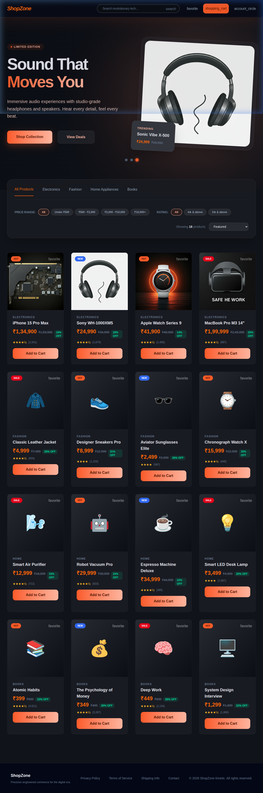

<div align="center">
  
  <h1>🛍️ ShopZone — Premium Tech Store</h1>
  <p>A full-stack, stunning E-commerce web application featuring a modern <b>"Glassmorphism"</b> aesthetic, built with React, Vite, Node.js, and SQLite.</p>
</div>

---

<div align="center">
  
  
  
  
  
  
  
  
</div>

## ✨ Features

- **🚀 Modern UI/UX Architecture**: Crafted with Tailwind CSS v4, utilizing a transparent dark aesthetic, dynamic blur backgrounds (Glassmorphism), and neon-orange accent glowing elements.
- **📱 Fully Responsive Design**: Flawlessly adapts to any screen size—from massive desktop monitors down to mobile devices.
- **🛒 Complete E-commerce Flow**: Features a dynamic Product Grid, Detailed Product Pages, Live Cart, Wishlist Management, User Profile, and a seamless Secure Checkout experience.
- **💾 Relational Database**: Uses `better-sqlite3` on the backend to execute rapid SQL queries to filter products (price, rating, search, categories) and persistently store user orders. 
- **🌐 RESTful API Backend**: A robust Node.js/Express server that securely handles data validation and database querying underneath.

## 📸 Sneak Peek

<div align="center">
  
</div>

## 🛠️ Technology Stack

| Area | Technology | Purpose |
|------|------------|---------|
| **Frontend Setup** | [Vite.js](https://vitejs.dev/) | Lightning fast HMR and optimized React bundling. |
| **Frontend Framework** | [React 18](https://react.dev/) | Component-based UI and dynamic state management (Context API). |
| **Styling** | [Tailwind CSS v4](https://tailwindcss.com/) | Utility-first deep styling combined with custom `@theme` variables for the visual design system. |
| **Backend Server** | [Node.js](https://nodejs.org/en) & [Express](https://expressjs.com/) | Powerful HTTP API and seamless server routing. |
| **Database** | [SQLite3](https://www.sqlite.org/index.html) | Zero-configuration SQL database engine, blazing fast via `better-sqlite3`. |

## 🚀 Getting Started

Follow the simple steps below to run this project seamlessly on your local machine.

### 1. Prerequisites
- Node.js (v18 or higher recommended)
- Optional: DB browsing software to view `shopzone.db`.

### 2. Backend Setup
1. Open a terminal and navigate to the backend directory:
   ```bash
   cd backend
   ```
2. Install dependencies (including Express, CORS, and better-sqlite3):
   ```bash
   npm install
   ```
3. Start the server (this automatically sets up the SQLite database and seeds default products):
   ```bash
   npm start
   ```
   > The server will continuously run on **[http://localhost:5000](http://localhost:5000)**

### 3. Frontend Setup
1. Open a new, separate terminal and navigate to the frontend directory:
   ```bash
   cd frontend
   ```
2. Install dependencies (React Router, etc.):
   ```bash
   npm install
   ```
3. Start the Vite development server:
   ```bash
   npm run dev
   ```
   > The user interface will run on **[http://localhost:5173](http://localhost:5173)**

## 📂 Project Structure Overview

```
ShopZone/
├── backend/                  # Node.js + Express API
│   ├── data/                 # Raw JSON fallback files
│   ├── db/
│   │   ├── setup.js          # SQLite instantiation script
│   ├── server.js             # API REST Routes 
│   ├── shopzone.db           # SQLite Database file 
│   └── package.json
│
└── frontend/                 # React.js application
    ├── src/
    │   ├── components/       # Navbar, Footer, Product Cards, etc.
    │   ├── context/          # Global State Management (Cart/Wishlist Contexts)
    │   ├── pages/            # Home, ProductDetail, Checkout, Favourites, Profile
    │   ├── App.jsx           # Main routing wrapper
    │   └── index.css         # Tailwind tokens & glassmorphism utilities
    ├── index.html            # Entry point loading Google Fonts & Material Symbols
    ├── vite.config.js        # Vite + Tailwind + Proxy configuration
    └── package.json
```

## 🔐 Advanced Implementation Details

* **Local Storage Synchronization**: Context APIs globally synchronize `Cart` and `Wishlist` data locally. Even if you exit the browser, you will resume right where you left off.
* **REST API Proxy**: To eliminate CORS frustration, Vite is statically configured (`vite.config.js`) to seamlessly proxy `/api` calls directly into your backend.
* **Security Details**: Payment mockups on the UI natively enforce UX without sending actual sensitive CC data through unencrypted pipelines.

---
<div align="center">
  <p>Engineered with ❤️ for seamless, striking online shopping experiences.</p>
</div>
# ShopZone---ecommerce
